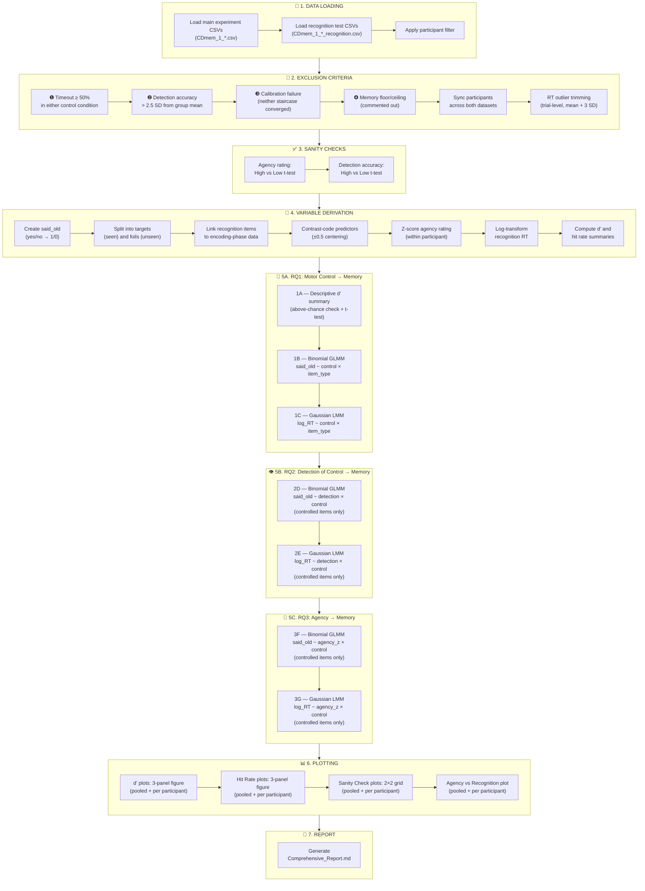

# CDmem Analysis Script — Step-by-Step Guide

This document explains what `CDmem_analyses_final.py` does, from start to finish, in plain language. It is designed so that anyone who reads it can understand the purpose of each section, even without running the code.

---

## Pipeline Flowchart



---

## What is this experiment about?

In the **CDmem** experiment, participants move two shapes on a screen using their mouse. One shape closely follows the participant's mouse movements (**controlled** item), and the other one moves more independently (**uncontrolled** item). The degree of control is manipulated to be either **high** (the shape tracks their mouse very well) or **low** (the shape tracks it less well).

After each trial, participants:
1. **Rate** how much control/agency they felt (1–7 scale) → `agency_rating`
2. **Guess** which of the two shapes they were controlling → `detection_accuracy` (1 = correct, 0 = incorrect)

Later, there is a **surprise recognition memory test**: participants see old images (from the experiment) and new images (never seen), and for each one they respond **"yes"** (I've seen this before) or **"no"** (I haven't).

**Main research question:** Does higher motor control over a shape during encoding lead to better memory for that shape later?

---

## Section-by-Section Explanation

### 1. Data Loading (lines 54–104)

The script loads two types of CSV files from the data directory:

| File type | Example filename | What it contains |
|---|---|---|
| **Main data** | `CDmem_1_*.csv` | Everything from the encoding phase: trials, mouse trajectories, agency ratings, detection accuracy, etc. |
| **Recognition data** | `CDmem_1_*_recognition.csv` | The memory test: for each image, did the participant say "yes" or "no"? |

A configurable participant filter controls which files are loaded. Only files whose participant number matches the filter are processed.

---

### 2. Exclusion Criteria (lines 106–179)

Not all participants' data is usable. The script applies **four** exclusion criteria sequentially:

#### ❶ Timeout Rate (≥ 50%)
If a participant didn't respond in time on ≥ 50% of trials in *either* the high or low control condition → **excluded**.

#### ❷ Accuracy Outliers (> 2.5 SD)
For each participant, the script computes their mean detection accuracy per condition (high/low). If their accuracy is more than 2.5 standard deviations away from the group mean → **excluded**.

#### ❸ Calibration Failure
Before the main experiment, there is a calibration phase where the system uses a QUEST+ staircase to find the right difficulty level. Each participant has two staircases (one for the "high" target accuracy, one for "low"). If *neither* staircase converged (final posterior SD ≥ 0.20) → **excluded**.

#### ❹ Memory Floor/Ceiling (commented out)
This criterion is written in the code but **disabled** (commented out). It would exclude participants who:
- Show no discrimination at all (*d'* < 0.10), or
- Say "yes" to almost everything (> 95%) or almost nothing (< 5%)

#### Participant Synchronization
After applying the above criteria, the script ensures both datasets (main + recognition) contain exactly the same participants. If a participant is missing from either file, they are dropped from both.

#### RT Outlier Trimming (trial-level)
Individual recognition trials where the reaction time exceeds that participant's **mean + 3 × SD** are removed. This is not a participant-level exclusion — only the specific slow trials are dropped.

---

### 3. Sanity Checks (lines 182–211)

Before running the main analyses, the script verifies that the **experimental manipulation worked** using paired t-tests:

| Check | What it tests | Expected result |
|---|---|---|
| **Agency ratings** | Do participants feel more control in the "high" condition? | High > Low (*p* < .05) |
| **Detection accuracy** | Are participants better at identifying the controlled shape in the "high" condition? | High > Low (*p* < .05) |

If these checks fail, the main results about memory cannot be meaningfully interpreted.

---

### 4. Variable Derivation (lines 214–321)

This section prepares all the variables needed for statistical modeling.

#### Key variables created:

| Variable | How it's made | What it means |
|---|---|---|
| `said_old` | `mem_response == "yes"` | Did the participant say they recognized this image? (True/False) |
| `said_old_int` | `said_old` as 0 or 1 | Same thing but as a number (needed for GLMMs) |
| `targets` | rows where `mem_ground_truth == "seen"` | Images that were **actually shown** during encoding (old items) |
| `foils` | rows where `mem_ground_truth == "unseen"` | Images that were **never shown** (new items) |
| `item_type` | `"controlled"` or `"uncontrolled"` | Was this the shape the participant controlled, or the other one? |
| `control_level` | `"high"` or `"low"` | The difficulty condition of that trial |
| `detection_accuracy` | 1 or 0 | Did the participant correctly identify the controlled shape? |
| `agency_rating` | 1–7 | How much control did the participant feel? |
| `agency_z` | z-scored within participant | Agency rating centered on each participant's own mean |
| `log_mem_rt` | `log(mem_rt)` | Log-transformed recognition reaction time |
| `Hit_rate` | proportion of `said_old == True` per condition | How often did they correctly say "yes" to old items? |
| `FA_rate` | proportion of `said_old == True` for foils | How often did they incorrectly say "yes" to new items? |
| `d_prime` | `z(Hit_rate) − z(FA_rate)` | Signal detection sensitivity — ability to tell old from new |

#### Contrast coding

All categorical predictors are **contrast-coded** around zero (±0.5). This means:
- `control_level_c`: High = +0.5, Low = −0.5
- `item_type_c`: Controlled = +0.5, Uncontrolled = −0.5
- `detection_accuracy_c`: Correct = +0.5, Incorrect = −0.5

**Why?** Centering predictors makes the model intercept represent the grand mean, and the coefficients represent the effect of moving from one level to the other.

#### Linking recognition to encoding

The recognition CSV knows which image the participant saw, but it doesn't know the encoding-phase measurements (agency rating, detection accuracy). The script links them back together using the **image filename** as a key.

---

### 5. Statistical Analyses (lines 388–483)

The analyses are organized around **three research questions**. Each question is tested with specific statistical models.

#### RQ1: Does higher motor control lead to better memory?

> *"If I control a shape more precisely, will I remember it better?"*

| Label | Model | Data used | DV | What it tests |
|---|---|---|---|---|
| **1A** | Descriptive d' summary + one-sample t-test | Participant-level *d'* values | d' | Confirms all participants perform above chance (d' > 0) |
| **1B** | Binomial GLMM (logit link) | All OLD items, trial-level | said_old (0/1) | Does control level × item type predict whether the participant says "yes"? |
| **1C** | Gaussian LMM | OLD items where participant said "yes" | log(RT) | Does control level × item type predict how fast they respond? |

> [!NOTE]
> **Descriptive d' vs GLMM:** Step 1A uses participant-level averages (*d'*) — one number per person — to verify above-chance performance with a one-sample t-test. The GLMM (1B) uses individual trial-level data and is more powerful because it uses all the raw data and accounts for the nested structure (trials within participants).

---

#### RQ2: Does detection of control matter for memory?

> *"Does it matter whether the participant* ***realized*** *they were in control?"*

| Label | Model | Data used | DV | What it tests |
|---|---|---|---|---|
| **2D** | Binomial GLMM | OLD **controlled** items only | said_old (0/1) | Does detecting control interact with control level to predict memory? |
| **2E** | Gaussian LMM | OLD **controlled** items (said "yes" only) | log(RT) | Same question, but for reaction times |

> [!IMPORTANT]
> These analyses are **restricted to controlled items only**. Why? Because `detection_accuracy` (whether the participant correctly identified the controlled shape) is only meaningful for the shape they actually controlled. The uncontrolled shape has no "detection" to speak of.

---

#### RQ3: Can subjective agency predict memory?

> *"Does* ***feeling*** *more in control — regardless of actual control level — predict better memory?"*

| Label | Model | Data used | DV | What it tests |
|---|---|---|---|---|
| **3F** | Binomial GLMM | OLD **controlled** items only | said_old (0/1) | Does within-participant variation in agency feelings predict memory hits? |
| **3G** | Gaussian LMM | OLD **controlled** items (said "yes" only) | log(RT) | Same question, but for reaction times |

> [!IMPORTANT]
> `agency_z` is the **z-scored** agency rating. This means we're asking: *within a given participant*, on trials where they felt *more* agency than their own average, did they also remember the shape better? This removes between-participant differences in how people use the scale.

---

#### Understanding the Models

All GLMMs and LMMs use the formula structure:

```
DV ~ predictor1 * predictor2 + (1 | participant)
```

Here's what each part means:

| Part | Meaning |
|---|---|
| `DV` | The outcome variable (e.g., `said_old_int` or `log_mem_rt`) |
| `predictor1 * predictor2` | Both main effects AND their interaction |
| `(1 \| participant)` | A random intercept for each participant — accounts for the fact that some people generally remember more/less than others |
| **Binomial GLMM** | Used when the DV is binary (0 or 1). Uses a logit link function |
| **Gaussian LMM** | Used when the DV is continuous (reaction time). Assumes normal distribution |

---

### 6. Plotting (lines 486–835)

The script generates **four types of figures**:

#### 6a. Memory Figures (d' and Hit Rate)

For each metric (*d'* and *Hit Rate*), a **three-panel figure** is generated:

| Row | Panel | What it shows |
|---|---|---|
| **Row 1** | 2×2 Factorial barplot | High vs Low × Controlled vs Uncontrolled (with SE error bars) |
| **Row 2** | Detection breakdown | Controlled items split into "detected" (dark green) and "not detected" (light green), plus uncontrolled (orange) |
| **Row 3** | Overall main effect | Simple High vs Low comparison (collapsing across item type) |

#### 6b. Sanity Check Plots

A **2×2 grid** of panels verifying the experimental manipulation:

| Panel | What it shows |
|---|---|
| **[0,0]** | QUEST+ calibration convergence (alpha SD over trials) |
| **[0,1]** | Detection accuracy by condition (bar chart) |
| **[1,0]** | Agency ratings by condition and detection accuracy |
| **[1,1]** | RT distribution (histograms by condition) |

#### 6c. Agency vs Recognition Memory Plots

A scatter/logistic plot showing the relationship between z-transformed agency ratings at encoding and subsequent recognition hit rate. Includes participant means, group means ± SE (binned), and a logistic trend line.

All plots are saved in two folders:
- **`CDmem_final_output/pooled/`** — group-level averages across all participants
- **`CDmem_final_output/per_participant/`** — one figure per participant

---

### 7. Report Output

Everything that is printed to the console is simultaneously written to:

```
CDmem_final_output/Comprehensive_Report.md
```

This Markdown file contains:
- Exclusion summaries
- Sanity check results
- Full model output tables
- **APA 7 reporting examples** — ready-to-copy sentences with italicized statistics

---

## Quick Reference: Analysis Labels

| Label | Research Question | Model Type | DV | Data Subset |
|---|---|---|---|---|
| **1A** | Control → Memory | Descriptive d' + one-sample t-test | d' | All participants |
| **1B** | Control → Memory | Binomial GLMM | said_old | All old items |
| **1C** | Control → Memory | Gaussian LMM | log(RT) | Old items, said "yes" |
| **2D** | Detection → Memory | Binomial GLMM | said_old | Old **controlled** items |
| **2E** | Detection → Memory | Gaussian LMM | log(RT) | Old **controlled** items, said "yes" |
| **3F** | Agency → Memory | Binomial GLMM | said_old | Old **controlled** items |
| **3G** | Agency → Memory | Gaussian LMM | log(RT) | Old **controlled** items, said "yes" |

---

## Output Folder Structure

```
CDmem_final_output/
├── Comprehensive_Report.md              ← Full statistical report
├── pooled/
│   ├── dprime_pooled.png               ← Group-level d' figure
│   ├── hitrate_pooled.png              ← Group-level hit rate figure
│   ├── sanity_check_pooled.png         ← Pooled sanity check (2×2 grid)
│   └── agency_recognition_pooled.png   ← Agency vs recognition (pooled)
└── per_participant/
    ├── dprime_p1.png                   ← Individual d' figures
    ├── hitrate_p1.png
    ├── sanity_check_p1.png             ← Individual sanity check
    ├── agency_recognition_p1.png       ← Individual agency vs recognition
    └── ...
```
