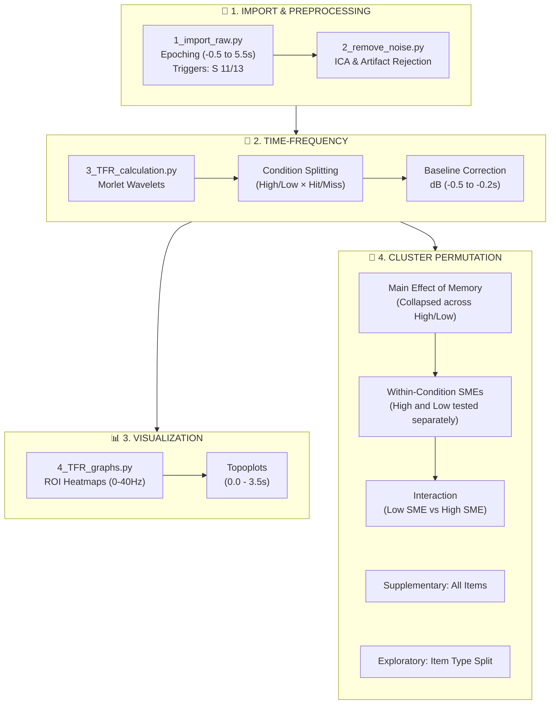

# CDmem EEG Analysis Overview

**Control Detection Memory (CDmem)**
Analysis Pipeline: Preprocessing, Time-Frequency Calculation, Visualization, and Permutation Statistics

---

## Pipeline Flowchart

---

## Experimental Design & Neural Context

During the **encoding phase**, participants perform a continuous tracking task viewing two items (one controlled, one uncontrolled) under 2 levels of control manipulation: **High** and **Low**. 
The EEG analyses primarily focus on the neural dynamics (alpha/beta oscillations) elicited during this period and how they relate to the subsequent recognition of the items.

---

## 1. Import & Preprocessing

### Script 1: `1_import_raw.py`
- **Goal:** Load raw BrainVision `.vhdr` files, apply standard montages, and segment the continuous EEG into trials.
- **Triggers:** Locked to the onset of the trial/stimulus (`Stimulus/S 11` for High Control, `S 13` for Low Control).
- **Epoching:** Extracts an extended window from `-0.5 s` to `+5.5 s` relative to stimulus onset.

### Script 2: `2_remove_noise.py`
- **Goal:** Visual inspection and artifact rejection.
- **Method:** Removes bad channels, applies ICA (to remove blinks and ocular artifacts), and drops epochs with extreme muscular or movement noise.

---

## 2. Time-Frequency Representation (TFR)

### Script 3: `3_TFR_calculation.py`
- **Goal:** Compute oscillatory power in the alpha/beta bands and split by subsequent memory performance.
- **Method:** Uses Morlet wavelets to extract power across frequencies. 
- **Baseline:** Applies a decibel (dB) baseline correction using the pre-stimulus `(-0.5, -0.2)` window.
- **Data Integration:** Loads behavioral performance and groups the EEG trials into the primary **4 conditions** (for the 'controlled' items):
  - `high_recalled` vs. `high_not_recalled`
  - `low_recalled` vs. `low_not_recalled`

---

## 3. Visualization

### Script 4: `4_TFR_graphs.py`
- **Goal:** Generate standardized plots for visual inspection of the grand averages.
- **Outputs:**
  1. **ROI Heatmaps:** Time-frequency plots (`0` to `40` Hz) for each condition, averaged over the predefined region of interest (ROI) channels.
  2. **Topoplots:** Scalp maps of power distribution, averaged over an extended time window (`0.0` to `3.5` s) and the predefined frequency range (`2` to `20` Hz).

---

## 4. Cluster-Based Permutation Statistics

### Script 5: `5_TFR_permutation.py`
- **Goal:** Perform rigorous, non-parametric 2D cluster-based permutation testing (Time × Frequency) to correct for multiple comparisons across the `(0.0, 3.0)` second and `(2.0, 20.0)` Hz statistical windows.
- **Method:** Evaluates primary and exploratory contrasts:

#### Analysis 1: Main Effect of Memory
- **Contrast:** `(High_rec + Low_rec) / 2`  **MINUS**  `(High_not + Low_not) / 2`
- **Question:** Is there a general neural signature of successful memory encoding (SME)?

#### Analysis 2: Within-Condition Memory Effects
- **Contrasts:** 
  - `High_rec - High_not`
  - `Low_rec - Low_not`
- **Question:** Does the SME exist significantly within each specific agency condition?

#### Analysis 3: Interaction (Memory × Control)
- **Contrast:** `(Low_rec - Low_not)`  **MINUS**  `(High_rec - High_not)`
- **Question:** Is the magnitude of the SME significantly different when control is Low compared to when control is High?

#### Supplementary & Exploratory Analyses
- **All Items (H5):** Collapses the analyses across both the controlled and uncontrolled items.
- **Item Type Split (Not Preregistered):** Explicitly evaluates the interaction of `Control Level` × `Item Type` (controlled vs. uncontrolled) on the SME (`Dm`).

---

## 5. Output Files Directory

All files are saved to `main_data/eeg/eeg5_figures_stimlocked/` sequentially:

| File Pattern | Contents |
|---|---|
| `00_heatmap_[condition].png` | ROI-averaged heatmap for the given condition (Script 4) |
| `00_topo_[condition].png` | Topography map for the given condition (Script 4) |
| `01_tf_permut_[contrast]_diff.png` | Grand average difference heatmap with significance contours |
| `01_stat_permut_[contrast].png` | Statistical T-value map highlighting the significant clusters |
| `02_tf_permut...` | Statistical maps for the Supplementary (All Items) analysis |
| `03_tf_permut...` | Statistical maps for the Exploratory (Item Type split) analysis |
| `TFR_permutation_statistics_report.txt` | Detailed text output listing the exact cluster p-values, time/freq bounds, and effect sizes (Cohen's d). |
