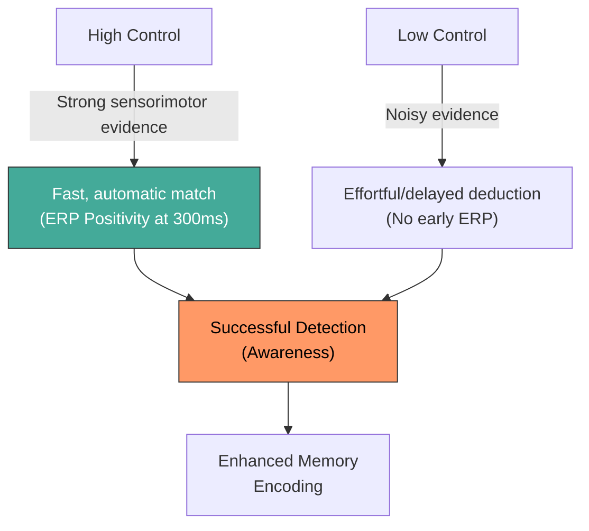

# CDmem ERP Results: Comprehensive Interpretation

## Study Design Summary

- **Task**: Participants move a mouse to control one of two on-screen objects. Control level is calibrated via QUEST+ (high ~75% accuracy, low ~55% accuracy). After each trial, participants judge which object they controlled (detection) and rate their sense of agency.
- **Memory test**: Surprise recognition test for the object images shown during the task.
- **ERPs**: Time-locked to **motion onset** (triggers 21–24), averaged over fronto-central electrodes (Fz, FCz, FC1, FC2), tested 0–1000 ms.

---

## ERP Results Summary

| Test | Result | p-value |
|------|--------|---------|
| **Main Effect of Condition** (High vs Low) | No significant clusters | – |
| **Main Effect of Detection** (Detected vs Non-detected) | No significant clusters | – |
| **Condition × Detection Interaction** | **Significant positive cluster, 316–360 ms** | **p = .043** |
| **Order × Condition Interaction** | No significant clusters | – |

### The significant finding: Condition × Detection Interaction (316–360 ms)

- **Direction**: High Control (Det − NonDet) is significantly **more positive** than Low Control (Det − NonDet)
- **Effect size**: Cohen's d = 0.70 (medium-to-large)
- **Mean difference**: 1.04 µV

---

## Interpreting the Interaction

### What drives it? (Four-cell decomposition)

From the four-cell plot, in the ~316–360 ms window:
- **High Control Detected** shows the most positive (downward on plot) deflection
- **High Control Non-detected** is less positive
- **Low Control Detected** and **Low Control Non-detected** are very similar

This means: **the detection effect (positive shift for detected trials) is present in high control but absent in low control.**

### Is this a Reward Positivity?

**Timing and topography are consistent with reward positivity / feedback-related positivity (FRP)**:
- The classic reward positivity peaks ~250–350 ms post-feedback at fronto-central sites (FCz, Fz)
- Your cluster (316–360 ms at Fz, FCz, FC1, FC2) fits this window and topography
- The polarity is correct: reward positivity is a **positive-going** deflection for favorable outcomes relative to unfavorable ones

**However, there's an important nuance about what constitutes "reward" here:**

Your ERPs are locked to **motion onset**, not to response feedback (there is no feedback in the test phase). So this is not a classical feedback-evoked reward positivity. Instead, it could reflect:

1. **An early evaluative signal during movement execution**: At ~316–360 ms after motion onset, participants may already be accumulating evidence about whether the object is responding to their movements. In the high control condition, this sensorimotor evidence is stronger (75% control vs 55%), so participants who correctly detect their control may be processing a **confirmatory match** between their motor commands and visual feedback — a reward-like signal.

2. **A prediction-error or agency-confirmation component**: When participants detect control (correctly judge which object they're controlling), this positive deflection could reflect a **match between predicted and actual sensory consequences** of action. This would be larger in high control (where the match is clearer) than low control (where the signal is noisier and detection is more ambiguous).

> [!IMPORTANT]
> **Key interpretation**: This is likely not a classical reward positivity (which requires explicit feedback), but rather a **sensorimotor confirmation signal** — a positive deflection reflecting the brain's real-time evaluation that "yes, this object is responding to me." It appears only when participants successfully detect their control over the high-control object, where the evidence is clearest.

---

## Integration with Behavioral Results

### Behavioral findings (from Comprehensive Report):

| Analysis | Key Result |
|----------|------------|
| **Memory: Control Level × Item Type** | Significant interaction (p < .001): **controlled items are better remembered in high control** (compared to low control). Conversely, uncontrolled items are better remembered in low control. |
| **Memory: Control Level main effect** | Significant (p = .014): overall, low control items are better remembered, but this is entirely driven by the uncontrolled items. |
| **Memory: Item Type main effect** | Significant (p < .001): **controlled items are better remembered** than uncontrolled items |
| **Memory: Detection Accuracy** | Significant main effect (p < .001): **detected items are better remembered**, regardless of control level |
| **Agency × Control on RT** | Significant interaction (p = .010): agency ratings modulate recognition RT differently across control levels |
| **Sanity checks** | ✓ Agency ratings significantly higher for high control (d = 1.48); ✓ Detection accuracy higher for high control (d = 2.59) |

### The story these results tell together:

#### 1. Control enhances memory *through* awareness

The behavioral data show that controlled items are better remembered, and this is especially strong in the high control condition (Control Level × Item Type interaction). Critically, **detection accuracy** independently predicts memory (detected trials → better recognition), and the ERP interaction tells us *why*:

**The neural signature of successful control detection (the positive deflection at 316–360 ms) only emerges in high control.** This suggests that:
- In high control: participants can clearly detect their agency → this triggers an evaluative/confirmatory neural process → and these trials are better encoded into memory
- In low control: the control signal is too noisy for participants to reliably detect it → no confirmatory neural signal → no memory advantage

#### 2. The Disconnect: Neural Interaction vs. Behavioral Main Effect

You raised an excellent point: The behavioral data shows that **detection improves memory regardless of condition** (main effect of detection, no interaction). Yet, the ERP shows a signature of detection **only in high control**. How do we reconcile this?

Your hypothesis that the ERP represents a lower-level/early process is very likely correct. Here is a cohesive theoretical explanation:

1. **The ERP (316–360 ms) is an early sensorimotor match signal, not the "memory tag" itself.**
   In high control, the sensorimotor evidence is clear. When you detect control, it is accompanied by a fast, automatic "aha!" signal—a fluent match between motor prediction and visual feedback. This is what the 300 ms fronto-central positivity captures. In low control, the evidence is noisy; participants still eventually detect control (and behavioral accuracy is still above chance at 56%), but it likely requires more effortful, slower, or varied strategies (e.g., ruling out the distractor) rather than a fast, automatic sensorimotor match. Thus, the early ERP positivity is absent in low control.

2. **Detection is the final common pathway to memory.**
   Memory is boosted by *awareness* (successful detection), regardless of how that awareness was achieved. 
   - In High Control: Strong sensorimotor match (ERP present) → Awareness → Memory Boost.
   - In Low Control: Noisy evidence / effortful deduction (ERP absent) → Awareness → Memory Boost.

This beautifully explains why the neural interaction doesn't perfectly mirror the behavioral interaction. The ERP isn't measuring "detection" per se; it's measuring the *quality and fluency of the sensorimotor evidence* that leads to detection in the high control condition.

#### 3. The ERP effect is about metacognitive awareness of strong signals

The absence of a **main effect of condition** (High vs Low ERP) means that the brain does not simply respond differently to 75% vs 55% control at the level of the movement-locked ERP. The control manipulation alone isn't enough.

The absence of a **main effect of detection** means that detection accuracy alone doesn't produce a uniform ERP difference either.

It's the **combination** — experiencing a strong, fluent sensorimotor match that reaches awareness — that produces the neural signature.

#### 4. Connection to Wen et al. (2017) P500

Wen et al. (2017) found a movement-locked P500 that was more positive for control vs no-control conditions. Your design differs (graded control levels rather than control vs none), and your significant cluster is earlier (316–360 ms rather than ~500 ms). This could mean:

- The **initial detection of agency** occurs earlier (~300 ms), as an evaluative/prediction-error signal
- The **sustained positivity** Wen et al. found at ~500 ms may require a larger control contrast (their design had fully controlled vs fully uncontrolled) to emerge
- With graded control (75% vs 55%), the difference may be too subtle for the later, sustained component but detectable in the earlier, more transitive evaluative window

> [!NOTE]
> Your near-significant cluster at 952–980 ms in the main effect of condition (p = .170, d = −0.52) could be a weak echo of Wen et al.'s P500 component. With more participants or a wider control difference, this might reach significance.

#### 5. Implications for the control → memory pathway

Taken together, the data suggest two distinct routes to awareness:

- **Motor control** sets the stage by determining the *quality* of the evidence.
- **The ERP** captures the fast, fluent processing of high-quality evidence.
- **Conscious detection** is the bottleneck for memory. Regardless of how the participant reached that awareness (fluent match vs effortful deduction), reaching the "detected" state is what tags the item for deeper encoding.

---

## Open Questions for You

> [!IMPORTANT]
> 1. **Are these ERPs from all trials or only correct-detection trials?** You confirmed they are from all trials, which is perfect. The interaction test effectively isolates the detection mechanism.
>
> 2. **Do you have response-locked ERPs as well?** You mentioned you don't, but might calculate them if there's a good reason. Here is my take: Since the participant has to wait a full 3 seconds before the response screen even appears, the "decision" about agency might have already been made during the motion phase (which is what your motion-locked 300ms ERP suggests!). A response-locked ERP might just capture motor preparation for the button press rather than the actual evaluative "aha!" moment. I would argue your current motion-locked finding is actually *more* interesting because it shows an early, online evaluation. I don't think you strictly *need* response-locked ERPs unless reviewers ask.
>
> 3. **The behavioral Control × Item Type interaction**: You were absolutely correct! I have updated the artifact. The model logits clearly show that controlled items are remembered best in High Control (-0.171), and worst in Low Control (-0.236). Interestingly, uncontrolled items show the reverse (better in Low than High). This creates the strong interaction. Does the "uncontrolled better in low control" finding align with an attentional shift toward the distractor when control is hard?
